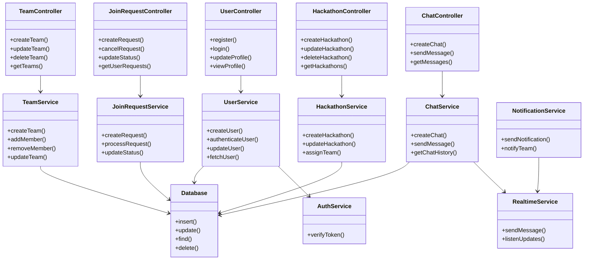

```mermaid

classDiagram

%% =====================
%% Controllers Layer
%% =====================

class UserController {
  +register()
  +login()
  +updateProfile()
  +viewProfile()
}

class TeamController {
  +createTeam()
  +updateTeam()
  +deleteTeam()
  +getTeams()
}

class JoinRequestController {
  +createRequest()
  +cancelRequest()
  +updateStatus()
  +getUserRequests()
}

class HackathonController {
  +createHackathon()
  +updateHackathon()
  +deleteHackathon()
  +getHackathons()
}

class ChatController {
  +createChat()
  +sendMessage()
  +getMessages()
}

%% =====================
%% Services Layer
%% =====================

class UserService {
  +createUser()
  +authenticateUser()
  +updateUser()
  +fetchUser()
}

class TeamService {
  +createTeam()
  +addMember()
  +removeMember()
  +updateTeam()
}

class JoinRequestService {
  +createRequest()
  +processRequest()
  +updateStatus()
}

class HackathonService {
  +createHackathon()
  +updateHackathon()
  +assignTeam()
}

class ChatService {
  +createChat()
  +sendMessage()
  +getChatHistory()
}

class NotificationService {
  +sendNotification()
  +notifyTeam()
}

%% =====================
%% Data Layer
%% =====================

class Database {
  +insert()
  +update()
  +find()
  +delete()
}

class AuthService {
  +verifyToken()
}

class RealtimeService {
  +sendMessage()
  +listenUpdates()
}

%% =====================
%% Relationships
%% =====================

UserController --> UserService
TeamController --> TeamService
JoinRequestController --> JoinRequestService
HackathonController --> HackathonService
ChatController --> ChatService

UserService --> Database
TeamService --> Database
JoinRequestService --> Database
HackathonService --> Database
ChatService --> Database

UserService --> AuthService
ChatService --> RealtimeService
NotificationService --> RealtimeService
```
