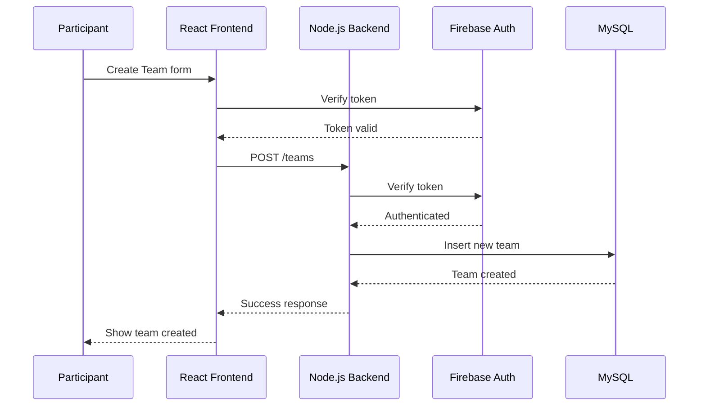

# High Level Sequence Diagram

## Use Case: Create Team & Join Hackathon

```mermaid

sequenceDiagram
    participant User as Participant
    participant Frontend as React Frontend
    participant API as Node.js Backend
    participant Auth as Firebase Auth
    participant DB as MySQL

    User->>Frontend: Create Team form
    Frontend->>Auth: Verify token
    Auth-->>Frontend: Token valid

    Frontend->>API: POST /teams
    API->>Auth: Verify token
    Auth-->>API: Authenticated

    API->>DB: Insert new team
    DB-->>API: Team created

    API-->>Frontend: Success response
    Frontend-->>User: Show team created
```
