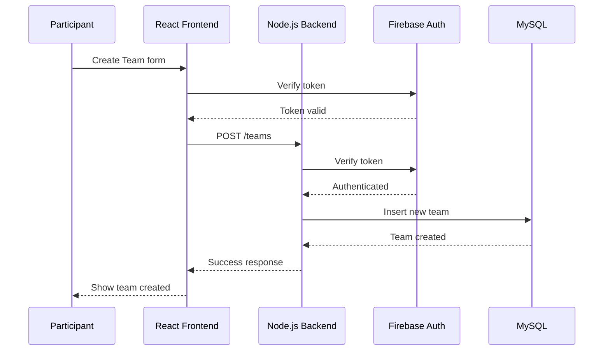

# High Level Sequence Diagram

## Use Case: Create Team & Join Hackathon


## Use Case: Join Request & Team Leader Respons
```mermaid

sequenceDiagram
    participant Participant
    participant Frontend as React Frontend
    participant API
    participant DB
    participant Firebase

    Participant->>Frontend: Send join request
    Frontend->>API: POST /join-request

    API->>DB: Save request (pending)
    DB-->>API: Request stored

    API->>Notification: Notify team leader
    Notification-->>Frontend: Real-time update

    API-->>Frontend: Request sent successfully
```
