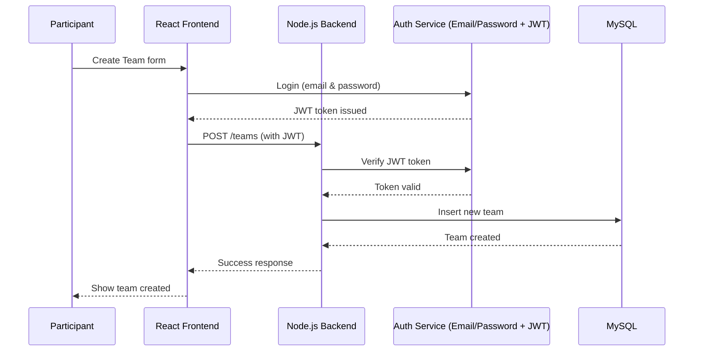
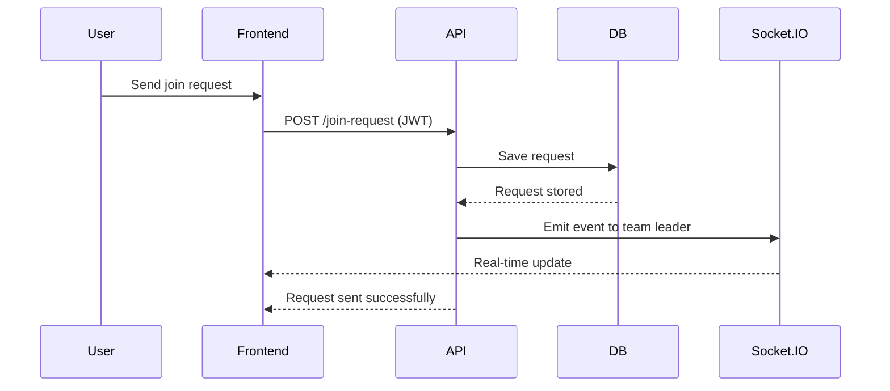
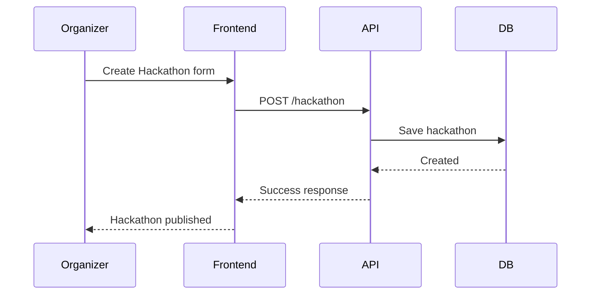

# High Level Sequence Diagram

## Use Case: Create Team & Join Hackathon

```mermaid

sequenceDiagram
    participant User as Participant
    participant Frontend as React Frontend
    participant API as Node.js Backend
    participant Auth as Auth Service (Email/Password + JWT)
    participant DB as MySQL

    User->>Frontend: Create Team form
    Frontend->>Auth: Login (email & password)
    Auth-->>Frontend: JWT token issued

    Frontend->>API: POST /teams (with JWT)
    API->>Auth: Verify JWT token
    Auth-->>API: Token valid

    API->>DB: Insert new team
    DB-->>API: Team created

    API-->>Frontend: Success response
    Frontend-->>User: Show team created
```

## Use Case: Join Request & Team Leader Respons

```mermaid
sequenceDiagram
    participant User
    participant Frontend
    participant API
    participant DB
    participant Socket as  Socket.IO

    User->>Frontend: Send join request
    Frontend->>API: POST /join-request (JWT)

    API->>DB: Save request
    DB-->>API: Request stored

    API->>Socket: Emit event to team leader
    Socket-->>Frontend: Real-time update

    API-->>Frontend: Request sent successfully
```

##Use Case: Organizer Creates Hackathon

```mermaid
sequenceDiagram
    participant Organizer
    participant Frontend
    participant API
    participant DB

    Organizer->>Frontend: Create Hackathon form
    Frontend->>API: POST /hackathon

    API->>DB: Save hackathon
    DB-->>API: Created

    API-->>Frontend: Success response
    Frontend-->>Organizer: Hackathon published
```
