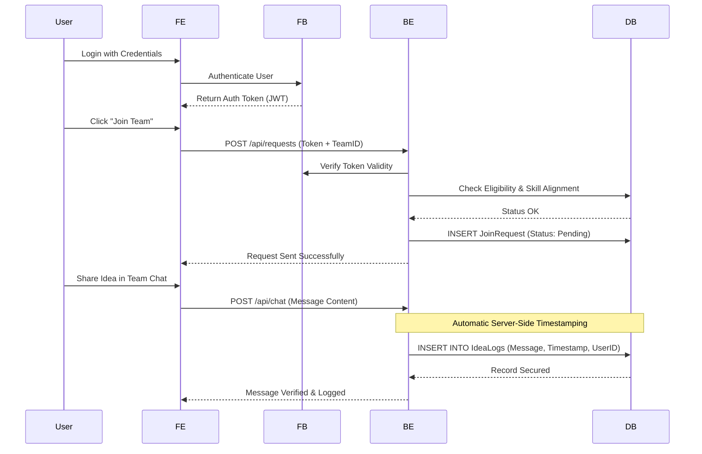

# MVP System Architecture
## High-Level Package Diagram (Three-Layer Architecture)

```mermaid
flowchart TD
    A[User (Browser)]
    B[React Frontend]
    C[Node.js + Express Backend]
    D[MySQL Database]

    A -->|User Interaction| B
    B -->|HTTP Request (JSON)| C
    C -->|Query / Store Data| D
    D -->|Data Response| C
    C -->|JSON Response| B
    B -->|Display Data| A
```

## Architecture Overview
The system is designed as a full-stack web platform following a Three-Layer Architecture. This structure ensures a clean separation of concerns between the user interface, business logic, and data persistence, with a specific focus on Data Integrity to support the platform's core "Idea Protection" feature.

### System Components
| Component | Technology | Description |
|----------|------------|-------------|
| Frontend | React.js | A responsive Single Page Application (SPA) where participants manage profiles, browse teams, and interact with the matching system. |
| Backend | Node.js (Express) | The central logic hub responsible for skill-matching algorithms, request validation, and secure communication. |
| Primary Database | MySQL | A relational database used to store structured data including User Profiles, Team Structures, and Membership Statuses. |
| Idea Protection | IdeaLogs (MySQL) | A specialized table within MySQL that records every chat message with a server-side timestamp to provide an immutable record of original ideas. |
| Authentication | Firebase Auth | Handles secure user registration and login, providing JWT tokens for session management. |

### Data Flow
The following sequence diagram illustrates the process of "Joining a Team" and the "Idea Protection" mechanism during communication:
sequenceDiagram
    participant User as Participant
    participant FE as React Frontend
    participant FB as Firebase Auth
    participant BE as Node.js Backend
    participant DB as MySQL Database



### Architectural Principles
Data Integrity & Traceability: By using MySQL, the system ensures strong relational links between users and their contributions. Every interaction is timestamped by the server (not the client) to prevent tampering with "Idea Ownership" records.

Security First: Every API endpoint is protected. No user can create a team or view private logs without a verified Firebase token checked against the backend.

Separation of Concerns: The Frontend handles presentation, the Backend handles logic/security, and the Data Layer handles persistence, making the system easier to debug and scale.

Extensibility: The RESTful design allows the team to easily integrate future features like a Mobile App or GitHub Portfolio integrations without rewriting the core backend.
