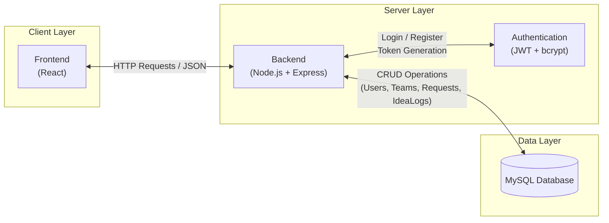
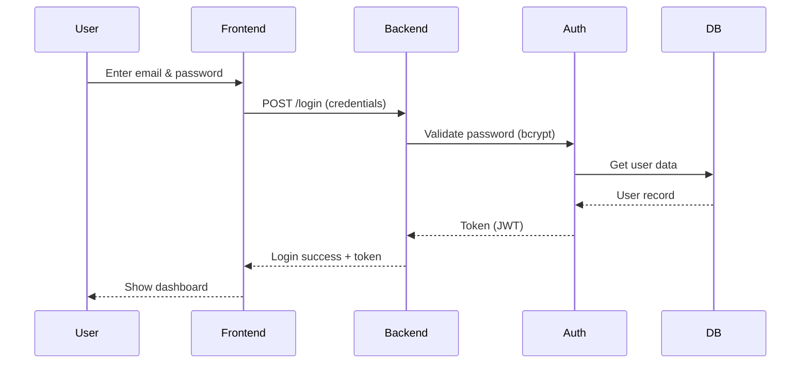

# MVP System Architecture
## High-Level Package Diagram (Three-Layer Architecture)

## Architecture Overview
The system follows a layered architecture consisting of a client layer (React frontend), a server layer (Node.js and Express backend), and a data layer (MySQL database). The frontend communicates with the backend using HTTP requests in JSON format. The backend processes requests, applies business logic, and handles authentication using JWT and bcrypt. It performs CRUD operations on the database for managing users, teams, requests, and idea logs. The system is designed as a monolithic architecture to ensure simplicity and efficient development for the MVP.

### System Components
| Component | Technology | Description |
|----------|------------|-------------|
| Frontend | React.js | A responsive Single Page Application (SPA) where participants manage profiles, browse teams, create teams, and send join requests. It communicates with the backend through RESTful API calls. |
| Backend | Node.js | The core system layer responsible for handling business logic such as team creation, join requests, matching logic, and data validation. It processes all client requests and communicates with the database. |
| Primary Database | MySQL | A relational database used to store structured data including user profiles, teams, join requests, and membership relationships with proper relational integrity. |
| Idea Protection | IdeaLogs (MySQL) | A dedicated database table that stores chat messages and shared ideas with server-side timestamps, ensuring traceability and providing evidence of idea ownership within teams. |
| Authentication | JWT + bcrypt | Handles secure user authentication using email and password. Passwords are hashed using bcrypt, and JWT tokens are generated upon login to manage user sessions and secure API endpoints. |

### Architectural Principles
Simplicity: The architecture is intentionally kept simple using a monolithic structure. This reduces development complexity, accelerates delivery, and ensures the team can focus on core features such as team formation, authentication, and matching logic.

Scalability: Although the MVP uses a monolithic structure, the system is designed in modular components (authentication, teams, requests, matching). This allows future migration into microservices if the system grows in usage or complexity.

Security by Design: 
Security is embedded into the architecture through:
- Password hashing using bcrypt
- Authentication using JWT tokens
- Protected API endpoints requiring valid tokens
- Input validation on backend requests

Performance Efficiency:
The system minimizes unnecessary external dependencies and uses direct backend processing for core logic. This reduces latency and improves response time between frontend and backend interactions.

Traceability:
Idea protection is implemented through timestamped logs stored in the database. This ensures transparency and accountability in collaborative environments.

## Data Flow
The system follows a structured data flow that ensures smooth communication between the frontend, backend, and database layers.

